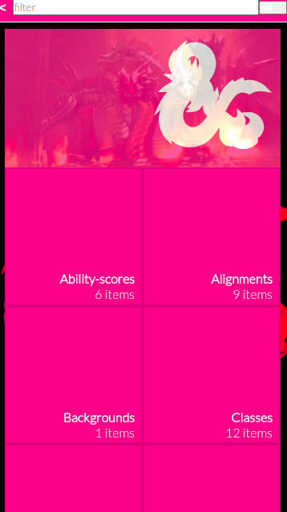

# D&D API Navigation Website

This is the app corresponding to the Microverse React redux capstone. It is a navigation website to display information from the D&D5e API.

## Screenshot

## Built With

- React
- Redux
- SASS
- React Test Library
- Jest
- FontAwesome

## Live Demo

coming soon

## Getting Started

**This is an example of how you may give instructions on setting up your project locally.**
**Modify this file to match your project, remove sections that don't apply. For example: delete the testing section if the currect project doesn't require testing.**

To get a local copy up and running follow these simple example steps.

### Prerequisites
- Node.js
### Setup
- clone the Repo: 
### Install

- In the cloned project folder, run 'npm run start'

### Usage

- In the main page, use the input bar at the top and click on the grey eye button at the top right to filter your categories.
- Click on a category square to go into it's submenu.
- In the submenu, click an item to get into the details.
- To go to the previous page from anywhere, click on the '<' button at the top left, in the header.
### Run tests

- In the terminal, write 'npm run test' and see the results.

## Authors

👤 **Rodrigo Ibaceta**

- GitHub: [Rodrigo Ibaceta](https://github.com/RokoVarano/)
- Twitter: [@Rodrigo](https://twitter.com/RodrigoIbacet11)
- LinkedIn: [LinkedIn](https://www.linkedin.com/in/rodrigo-ibaceta-a8657611a/)
## 🤝 Contributing

Thanks to [Leigh Halliday](https://www.youtube.com/watch?v=vbvQzWDCuXU) and [Michell Ayala](https://www.youtube.com/watch?v=BpssbStj-oI) for your tutorial videos. They were very helpful!

Thanks to [Nelson Sakwa on Behance](https://www.behance.net/sakwadesignstudio) for allowing me to use his theme.

Contributions, issues, and feature requests are welcome!

Feel free to check the [issues page](https://github.com/RokoVarano/math-magicians/issues).

## Show your support

Give a ⭐️ if you like this project!

## Acknowledgments

- Hat tip to anyone whose code was used
- Inspiration
- etc

## 📝 License

This project is [MIT](https://opensource.org/licenses/MIT) licensed.